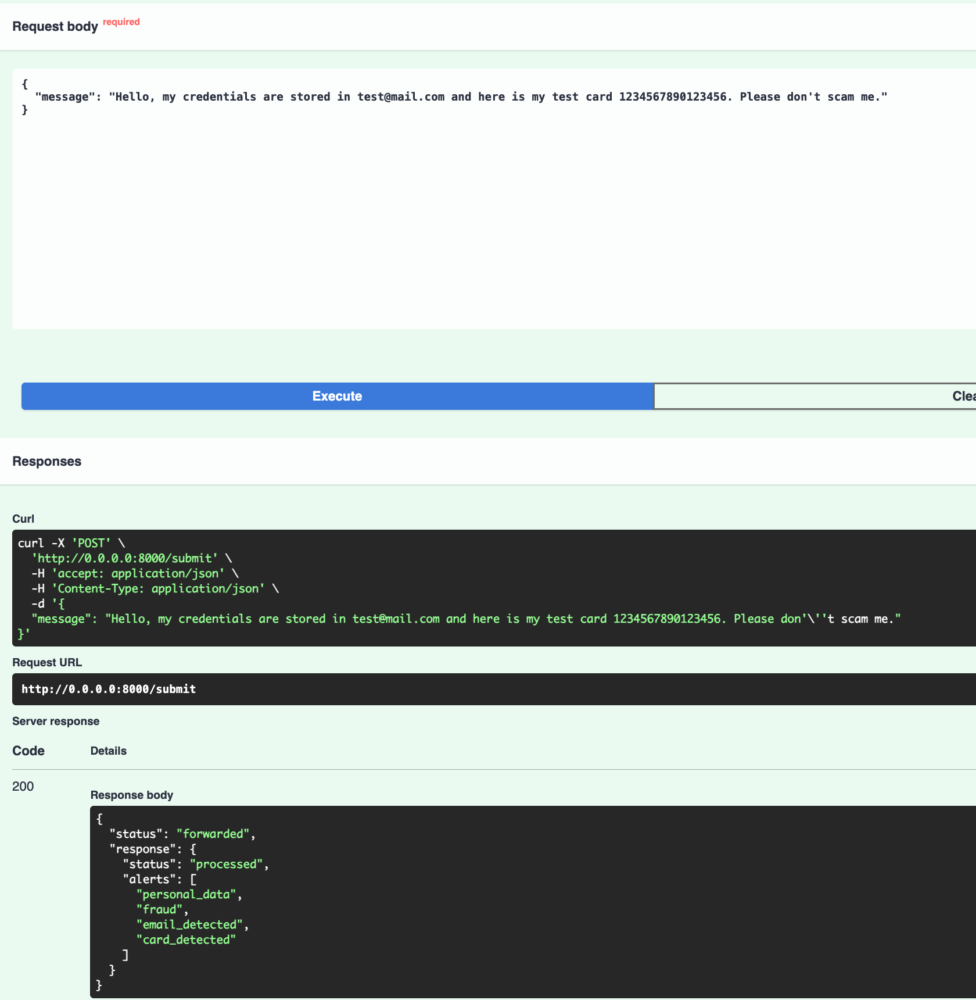
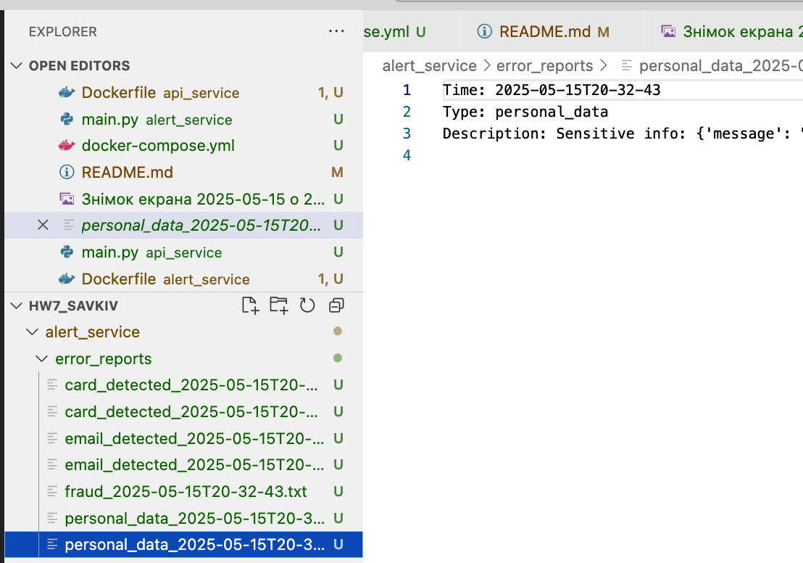
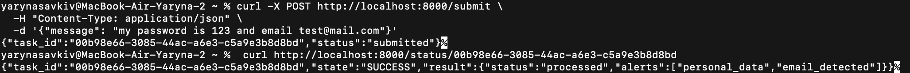

# HW7  
## Task 1: Logging and Alerts

This task implements a two-container system that performs logging and basic alerting based on incoming user messages using FastAPI and Docker Compose.

---

## 🧩 Architecture

The system consists of two microservices:
- **api_service**: Accepts user requests (`/submit`) and forwards them to the alert processor.
- **alert_service**: Analyzes the input, detects patterns such as fraud or personal data, and creates alert reports if necessary.

The services communicate via HTTP.

```
User → api_service → alert_service
                      ↓
                Alert Reports
                InfluxDB Logs
```

---

## 🧪 Logging Approaches

### ✅ Initial: Approach 1 — File-based logging

At first, we implemented logging using the built-in Python logging system and saved logs to `.txt` files in the `logs/` folder for each service:

- `api_service/logs/app.log`
- `alert_service/logs/app.log`

This approach met the basic requirement of logging interactions, and screenshots were taken showing log files and error reports generated.

### ✅ Improved: Approach 2 — InfluxDB integration

To enhance observability, we then integrated **InfluxDB** (a time-series database) into both services using a custom `InfluxDBLogHandler`.

Now, all logs are:
- ✅ Stored in InfluxDB (`log_event` measurement) at `localhost:8086`
- ✅ Still mirrored to the local `.log` files for redundancy

This allows time-series analysis, querying, and potential visualization (e.g., via Grafana).

InfluxDB is initialized and pre-configured with:
```env
INFLUXDB_URL=http://influxdb:8086
INFLUXDB_DB=logs
INFLUXDB_USER=admin
INFLUXDB_PASS=adminpass
```

---

## 🚨 Alerts

The `alert_service` detects the following patterns in messages:
- `"password"`, `"secret"`, `"credentials"` → personal data
- `"fraud"`, `"scam"`, `"fake"` → fraud attempt
- Email pattern → via regex
- Card-like numbers → sequences of 10+ digits

Each alert triggers the creation of a mini-report inside:
```
alert_service/error_reports/
```

---

## 📦 How to Run

```bash
docker-compose up --build
```

Then test with:

```bash
curl -X POST http://localhost:8000/submit \
  -H "Content-Type: application/json" \
  -d '{"message": "my secret email is test@mail.com and my card is 1234567890123456"}'
```

---

## ✅ Output

- Alert reports appear in `alert_service/error_reports/`
- Logs are saved in:
  - `logs/app.log` (both services)
  - `InfluxDB` as time-series data (see below)

---

## 🔎 Verify Logs in InfluxDB

To view logs written to InfluxDB:

```bash
curl -G 'http://localhost:8086/query?db=logs' \
  --data-urlencode "q=SELECT * FROM log_event"
```

---

## 🖼️ Screenshots

**Swagger UI (POST /submit form):**  


**Generated alert reports folder (Approach 1):**  


**Query to InfluxDB showing logs (Approach 2):**  

---

## Task 2: Celery Workers

This task adds asynchronous processing to the system using **Celery** with **Redis** as a message broker. It enables scalable handling of concurrent user requests without blocking the API.

---

## ⚙️ Architecture

In addition to `api_service` and `alert_service`, two new services were added:

- **worker**: A Celery worker that asynchronously processes tasks sent from `api_service`.
- **redis**: A lightweight message broker used by Celery to queue tasks.

```
User → api_service → Redis queue → worker → alert_service
```

---

## 📬 How It Works

1. User sends a POST request to `/submit`.
2. The `api_service` sends the message as a task to Celery.
3. Celery worker picks it up and sends it to `alert_service`.
4. `alert_service` processes the message and triggers alerts if needed.
5. Logs are written to both InfluxDB and `.log` files.

---

## 📥 Endpoints

### `POST /submit`
Sends a task to the Celery worker asynchronously.

Example:

```bash
curl -X POST http://localhost:8000/submit \
  -H "Content-Type: application/json" \
  -d '{"message": "my password is 123 and email test@mail.com"}'
```

Response:

```json
{
  "task_id": "abc123...",
  "status": "submitted"
}
```
---

### `GET /status/{task_id}`

Checks the status of the background task by its ID.

```bash
curl http://localhost:8000/status/abc123...
```

Example response:

```json
{
  "task_id": "abc123...",
  "state": "SUCCESS",
  "result": {
    "status": "processed",
    "alerts": ["personal_data", "email_detected"]
  }
}
```

---

## ✅ Output

- Tasks are processed asynchronously.
- Logs and alerts are generated exactly as in Task 1.
- Redis and Celery ensure scalability under multiple simultaneous requests.

---

## 🖼️ Screenshot

**Celery task submitted and completed (logs or status endpoint):**  


---

## Task 3: System Architecture

This section summarizes the full system architecture combining all components: services, asynchronous processing, logging, and alerting.

---

### 🧩 Components

| Component        | Role                                                                 |
|------------------|----------------------------------------------------------------------|
| **api_service**   | Accepts user requests (`/submit`) and queues tasks via Celery       |
| **alert_service** | Analyzes messages, detects patterns, writes alerts and logs         |
| **worker**        | Celery worker that asynchronously sends messages to `alert_service`|
| **redis**         | Message broker for Celery                                           |
| **influxdb**      | Stores logs in time-series format                                   |
| **logs/*.log**    | Local logs in each container                                        |
| **error_reports/**| Plaintext alert reports generated by alert_service                 |

---

### 🔄 Operational Flow

```
User
 ↓
api_service (sync: POST /submit)
 ↓                            ↘
Redis queue                /status/{task_id}
 ↓                             ↓
Celery worker --------------→ alert_service
                                 ↓
                        Alerts (.txt) + Logs (.log + InfluxDB)
```

---

### 🔧 Operation Types

| Type         | Operation                    | Sync/Async | Handler              |
|--------------|------------------------------|------------|----------------------|
| `/submit`    | Submit user message          | ✅ Sync     | `api_service`        |
| Celery Task  | Analyze + log alerts         | 🌀 Async    | `worker → alert_service` |
| `/status`    | Check task result            | ✅ Sync     | `api_service`        |

---

### ✅ Logging and Alerts

- Logs are written to both:
  - Local `.log` files
  - InfluxDB (`log_event` measurement)
- Alerts are written as `.txt` reports to:
  ```
  alert_service/error_reports/
  ```

---

### 🧪 Technologies Used

- Python, FastAPI, Celery
- Redis (broker)
- InfluxDB (logging)
- Docker Compose
- Bash, curl (manual testing)
